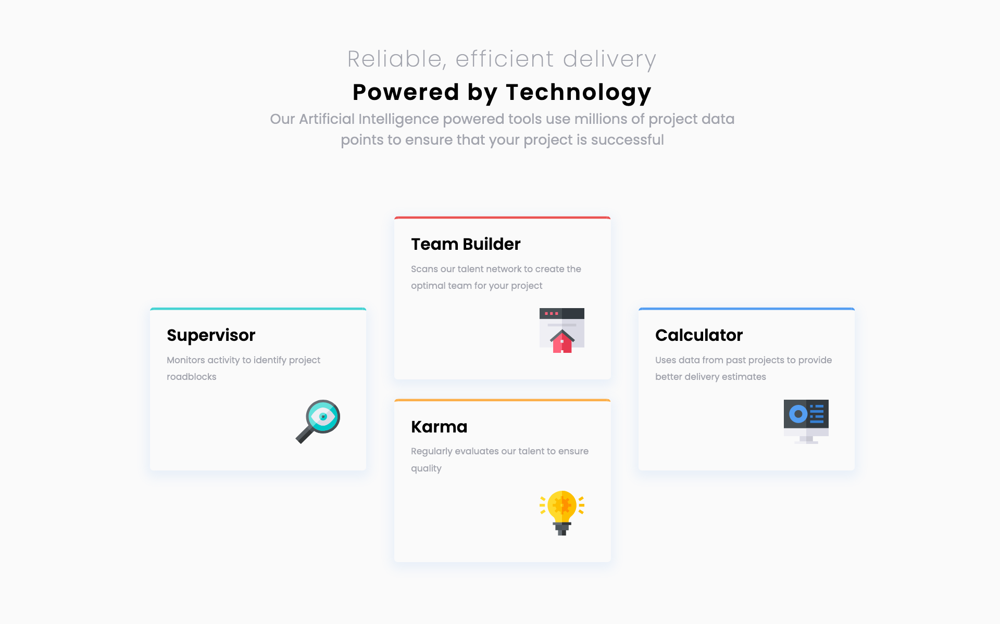
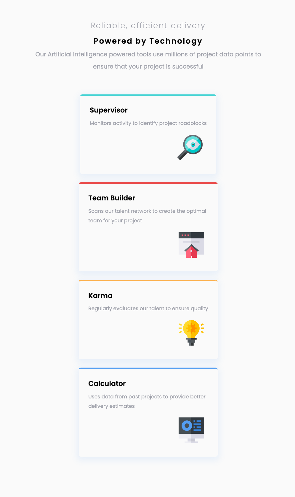

# Frontend Mentor - Four card feature section solution

## Table of contents

- [Overview](#overview)
  - [The challenge](#the-challenge)
  - [Screenshot](#screenshot)
  - [Links](#links)
- [My process](#my-process)
  - [Built with](#built-with)
- [Author](#author)
- [Acknowledgments](#acknowledgments)

**Note: Delete this note and update the table of contents based on what sections you keep.**

## Overview

In the quest for developing my frontend skills I have completed another challenge Four card feature section, on this challenge I have been able to reinforce responsive layout skill with flexbox. This website is responsive on all devices, The project was built with HTML and CSS.

### The challenge

Users should be able to:

- View the optimal layout for the site depending on their device's screen size

### Screenshot

### Links

- Solution URL: [Github repo URL here](https://github.com/ahmedsaliuGit/four-card-feature-section)
- Live Site URL: [Live site URL here](https://ahmedsaliugit.github.io/four-card-feature-section/)

## My process

### Built with

- Semantic HTML5 markup
- CSS custom properties
- Flexbox
- Mobile-first workflow

## Author

- Website - [Ahmed Saliu](https://www.frontendmentor.io/profile/ahmedsaliuGit)
- Frontend Mentor - [@ahmedsaliuGit](https://www.frontendmentor.io/profile/ahmedsaliuGit)

## Acknowledgments

Frontend Mentor thank you for creating this platform
